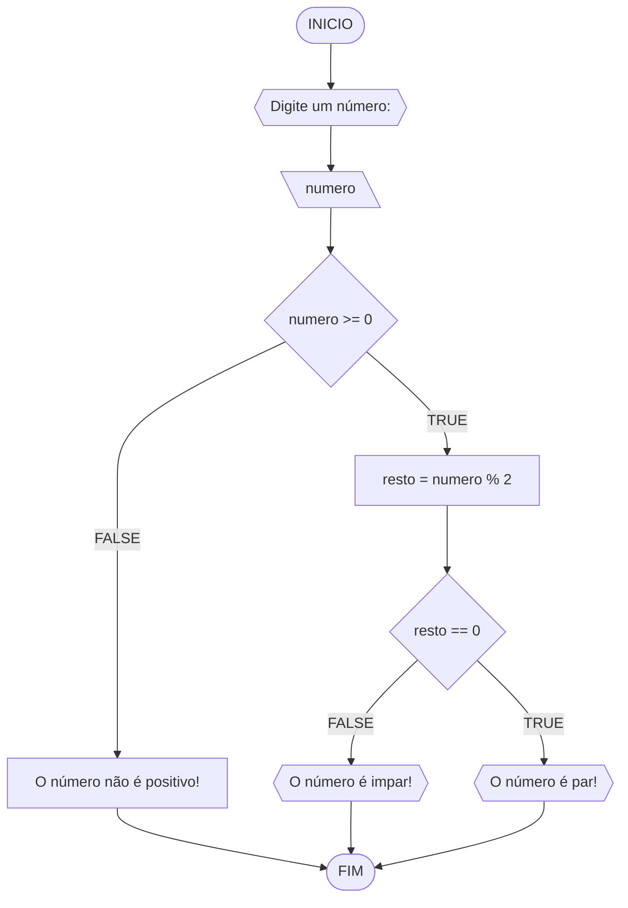
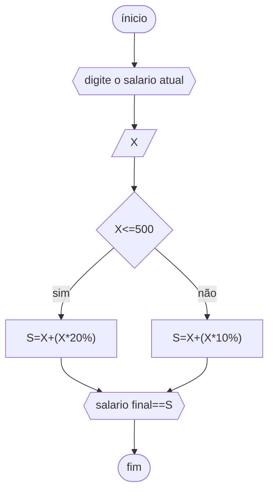
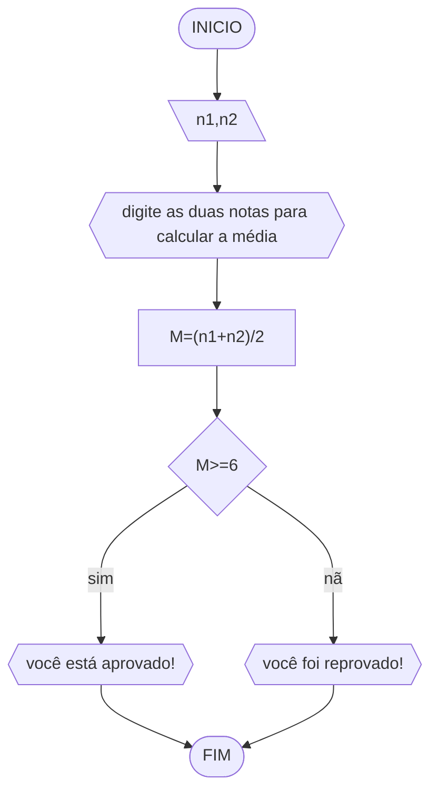
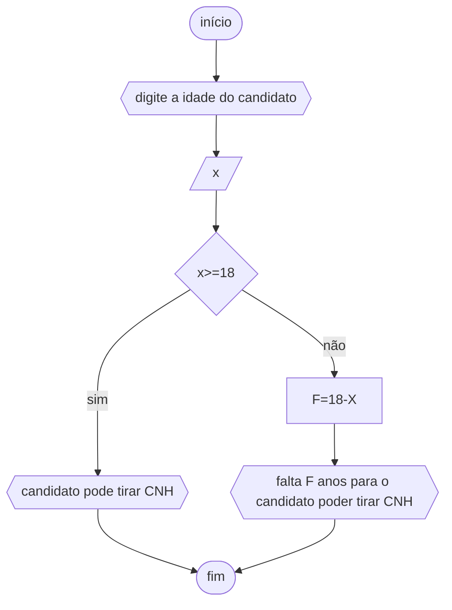

# UNIFOR
**Nome**: Ian Oliveira dos Santos <br>
**Disciplina**: Raciocínio lógico algorítmico

## Lista de exercícios 01

### Exercício 01 (1 ponto)
Represente, em fluxograma e pseudocódigo, um algoritmo para determinar se um número inteiro e positivo é par ou impar.

#### Fluxograma (0,25 ponto)



#### Pseudocódigo (0,5 ponto)
```
1  ALGORTIMO verifica_par_impar

   // Receber número inteiro para verificar par_impar
2  DECLARE numero, resto: INTEIRO

   // Exibe a mensagem para entrada de dados
3  ESCREVA "Digite um número: "


4  INICIO

   // Armazena a entrada do usuário
4  LEIA numero

   // verifica se o inteiro é positivo
5  SE numero >= 0 ENTAO

     // calcula o resto da divisão por 2             
6    resto = numero % 2

     // verifica se o resto é igual a zero            
7    SE resto == 0 ENTAO

       // exibir a mensagem        
8      ESCREVA "O número é par!"

     // estrutura condicional
9    SENAO

       // exibir mensagem
10     ESCREVA "O número é impar!"

     // fim estrutura condicional
11   FIM_SE

    // caso o numero nao faça parte da estrutura 
11  SENAO

      // Exibir mensagem                          
12    ESCREVA "O número deve ser postivo!"
13  FIM_SE
13 FIM
```

#### Teste de mesa (0,25 ponto)
| numero | numero >= 0 | resto | resto == 0 | Saída |
| -- | -- | -- | -- | -- | 
| -1 | F |   |   | "O número deve ser postivo!" |
| 0  | V | 0 | V | "O número é par!" |
| 13 | V | 1 | F | "O número é impar!" |
| 30 | V | 0 | V | "O número é par!" |

## Exercício 02 (3 pontos)
Represente, em fluxograma e pseudocódigo, um algoritmo para calcular o novo salário de um funcionário. 
Sabe-se que os funcionários que recebem atualmente salário de até R$ 500 terão aumento de 20%; os demais terão aumento de 10%.

#### Fluxograma (1.0 ponto)




#### Pseudocódigo (1.0 ponto)

```
Algoritmo ContaAprovacoes

   // Receber valor do salario
   DECLARE X, S NUMÉRICO

   // Exibir a mensagem para entrada de dados
   ESCREVA "DIGITE O SALÁRIO ATUAL"

   // Armazenar a entrada de dados
   LEIA X

      // Estrutura condicional 
      SE X<=500 ENTÃO

          // calcular estrutura condicional
          S⇐X+(X*20%)

      // caso a estrutura passada nao seja condizente, fazer novo calculo
      SENÃO S⇐X+(X*10% )

   // Exibir resultado final do algoritmo
   ESCREVA "SALÁRIO FINAL=" S
FIM_ALGORITMO.
```


#### Teste de mesa (1.0 ponto)
|salário atual|x>500|x<=500|salário final|
|--|--|--|--|
|450|/|450+(450*20%)|540|
|670|670+(670*10%)|/|737|
|500|/|500+(500*20%)|600|


## Exercício 03 (3 pontos)
Represente, em fluxograma e pseudocódigo, um algoritmo para calcular a média aritmética entre duas notas de um aluno e mostrar sua situação, que pode ser aprovado ou reprovado.

#### Fluxograma (1 ponto)



#### Pseudocódigo (1 ponto)

```ALGORITMO

   // Receber valores 
   DECLARE N1, N2, M NÚMERICO

      // exibir a mensagem para entrada de dados
      ESCREVA "DIGITE DOIS NÚMEROS"

      // Armazenar a entrada dos valores
      LEIA N1,N2

      // realizar o calculo da media
      M⇐(N1+N2)/2

   // Exibir o valor da media
   ESCREVA "MÈDIA="M

   // Estrutura condicional
   SE M>=6 ENTÃO

 // Exibir resultado
 ESCREVA "APROVADO"

// Exibir resultado de condicional
SENÃO ESCREVA "REPROVADO"
FIM_ALGARITMO
```
#### Teste de mesa (1 ponto)
|nota1|nota2|média|resultado|
|--|--|--|--|
|5|8|6.5|"você está aprovado!"|
|7|3|5|"você foi reprovado!"|
|7|7|7|"você está aprovado!"|
## Exercício 04 (3 pontos)
Represente, em fluxograma e pseudocódigo, um algoritmo que, a partir da idade do candidato(a), determinar se pode ou não tirar a CNH. 
Caso não atender a restrição de idade, calcular quantos anos faltam para o candidato estar apto.

#### Fluxograma (1.0 ponto)


#### Pseudocódigo (1.0 ponto)

```
ALGORITMO

// Receber dados 
DECLARE X, F NUMÉRICO

// Exibir a mensagem para entrada de dados
ESCREVA"DIGITE A IDADE DO CANDIDATO"

// Armazenar a entrada do usuario
LEIA X

   // Estrutura condicional, caso o candidato tenha 18 anos ou mais
   SE X>=18 ENTÃO

       // Exibir a mensagem 
       ESCREVA "PODE TIRAR CNH"

   // estrutura condicional Caso o candidato nao tenha idade suficiente
   SENÃO F⇐18-X

// Exibir mensagem
ESCREVA "FALTAM"F"ANO(s) PARA PODER TIRAR CNH" 
FIM_ALGORITMO
```

#### Teste de mesa (1.0 ponto)
|nome  |idade|idade que falta|resultado|
|--    |--   |--             |--       |
|Hasten|18   |--             |pode tirar CNH|
|Savio |16   |18-16=2        |faltam 2 anos para poder tirar CNH|
|Clara |8    |18-8=10        |faltam 10 anos para poder tirar CNH|
