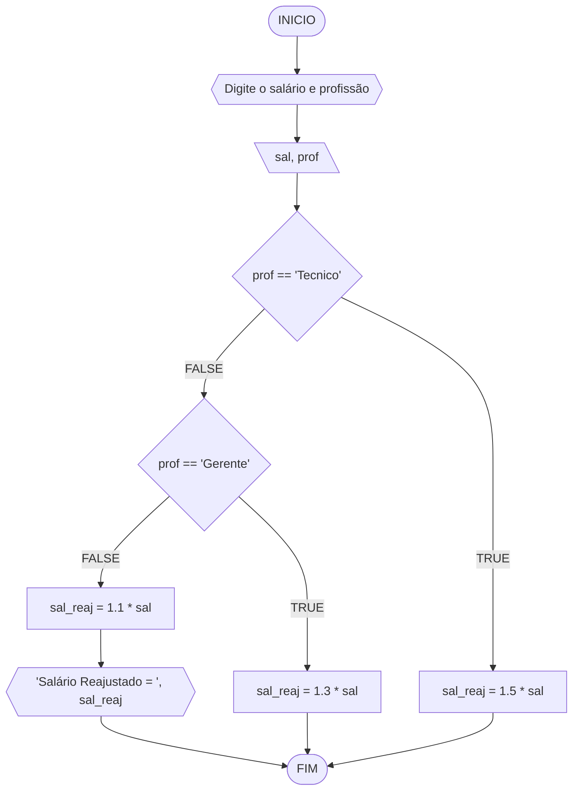
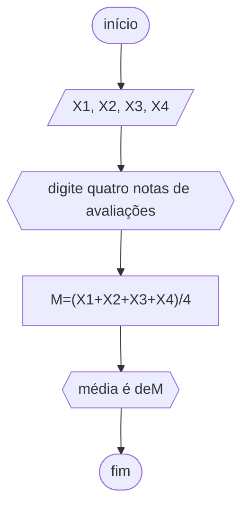
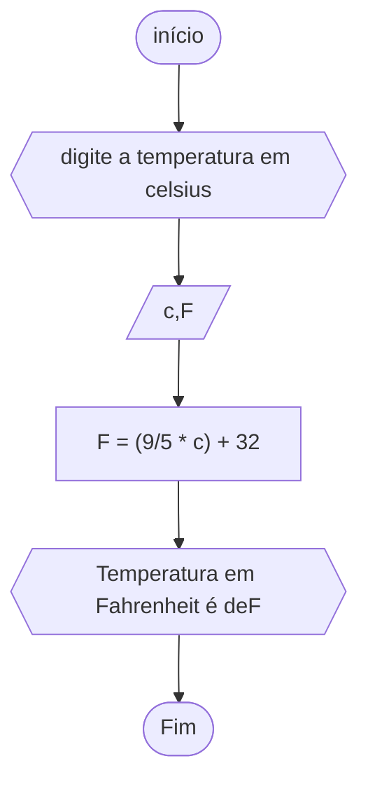
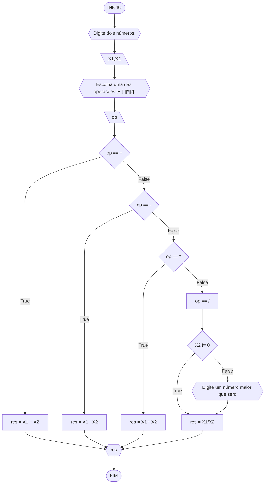
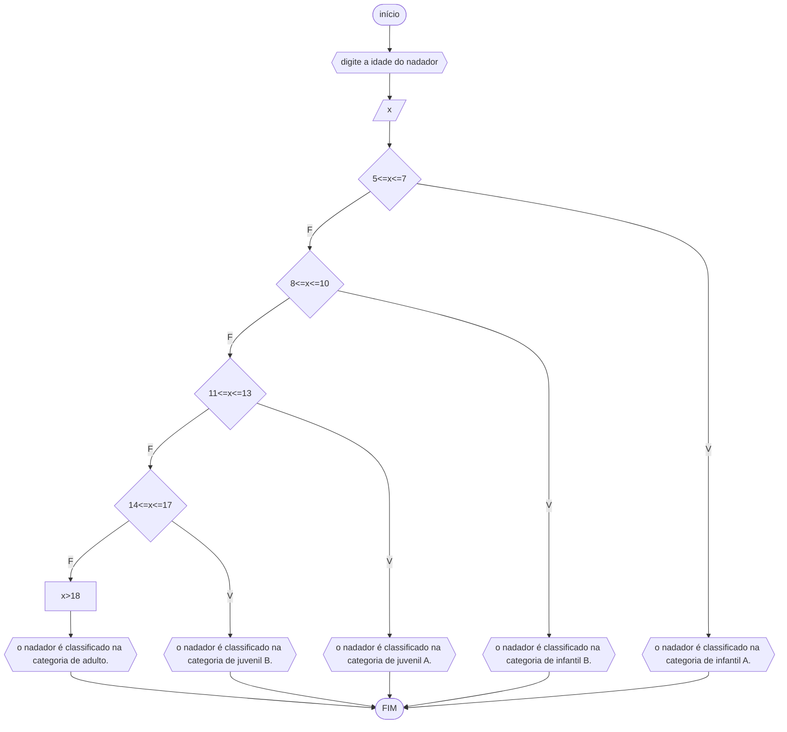

# UNIFOR
**Nome**: Ian Oliveira dos Santos <br>
**Disciplina**: Raciocínio lógico algoritmico

## Exercício exemplo
Represente, em fluxograma e pseudocódigo, um algoritmo para calcular o adicional de salário de funcionário por cargo de uma empresa fictícia. Sabe-se que os funcionários de cargo técnico receberão reajuste de 50%, cargo de gerência, um reajuste de 30% e demais, um reajuste de 10%. 

#### Fluxograma


#### Pseudocódigo
```
1  ALGORITMO calReajuste

   // Receber dados
2  DECLARE  sal, sal_reaj: real, prof: caractere

3  INICIO

   // Armazenar a entrada do usuario
4  LEIA sal, prof

   
5  ESCOLHA
    // caso a condicional indique o cargo, realizar calculo
6   CASO prof == “Técnico”

      // calculo para cargo de tecnico
7     sal_reaj ← 1.5 * sal

    // condicao caso o professor seja gerente
8   CASO prof = “Gerente”

      // realizar calculo de cargo de gerente
9     sal_reaj ← 1.3 * sal

    // estrutura condicional caso nao seja gerente e tecnico
10  SENÃO

      // calculo do reajuste
11    sal_reaj ← 1.1 * sal
12 FIM_ESCOLHA
13 ESCREVA “Salário Reajustado = “, sal_reaj
14 FIM
```

#### Teste
| sal | prof | prof == “Técnico” | prof = “Gerente” | sal_reaj | Saída |
| -- | -- | -- | -- | -- | -- |
| 1000 | Técnico | V | F | 1500 | “Salário Reajustado = 1500“ |
| 2000 | Gerente | F | V | 2600 | “Salário Reajustado = 2600“ |
| 9000 | Diretor | F | F | 9900 | “Salário Reajustado = 9900“ |

## Lista de exercícios 02

### Exercício 01 (2.5 pontos)
Calcule a média de quatro números inteiros dados.

#### Fluxograma (1.0 ponto)



#### Pseudocódigo (1.0 ponto)

```
ALGORITMO calcmédia

// Receber numeros inteiros
DECLARE X1, X2 , X3, X4, M NÚMERICO INTEIRO

INÍCIO

   // Exibir mensagem para entrada de dados
   ESCREVA "DIGITE QUATRO NOTAS DE AVALIAÇÕES "

   // Armazenar a entrada do usuario
   LEIA X1, X2, X3, X4

   // calcular a media
   M<--(X1+X2+X3+X4)/4

   // Exibir mensagem
   ESCREVA"MÉDIA="M
FIM_ALGORITMO
```

#### Teste de mesa (0.5 ponto)


|X1|X2|X3|X4|soma| média |
|-|-|-|-|-|-|
|6|6|9|7|28|7
|7|6|4|3|20|5
|3|6|9|6|24|6

### Exercício 02 (2.5 pontos)
Leia uma temperatura dada em Celsius (C) e imprima o equivalente em Fahrenheit (F). (Fórmula de conversão: F = (9/5) * C + 32)

#### Fluxograma (1.0 ponto)


#### Pseudocódigo (1.0 ponto)

```
ALGORITMO calctemperatura

// Receber dados
DECLARE c, F NÚMERICO

INÍCIO

   // Exibir mensagem para entrada de dados
   ESCREVA "digite a temperatura em Celsius"

   // Armazenar a entrada do usuario
   LEIA c

   // calculo da funcao
   F<--(9/5*c)+32

   // Exibir mensagem
   ESCREVA "Temperatura em Fahrenheit é de" F
FIM_ALGORITMO
```

#### Teste de mesa (0.5 ponto)

|Celsius (C°)|calculo|Fahrenheit (F°)|
|-|-|-|
|75|(9/5*75)+32|135|
|85|(9/5*85)+32|153|
|55|(9/5*55)+32|99|

### Exercício 03 (2.5 pontos)
Receba dois números reais e um operador e efetue a operação correspondente com os valores recebidos (operandos). 
O algoritmo deve retornar o resultado da operação selecionada simulando todas as operações de uma calculadora simples.

#### Fluxograma (1.0 ponto)


#### Pseudocódigo (1.0 ponto)

```
1 ALGORITMO calculadora


2 DECLARE X1, X2: real                                             // Receber dados
3	op: caractere                                             // dados da operacao
4 INÍCIO
5 ESCREVA "Digite dois números: "                                // Exibir mensagem para entrada de dados 
6 LEIA X1, X2                                                   // Armazena a entrada 
7 ESCREVA "Escolha uma das operações [+][-][*][/]: "           // Exibir a mensagem para escolher a operacao
8 LEIA op                                                      // Armazenar operacal escolhida
9     CASO op == +                                              // caso a operacao seja de adicao
10    CALCULE res = X1 + X2                                       // calcular a operacao de adicao
11      CASO op == -                                             // caso a operacao seja de subtracao
        CALCULE res = X1 - X2                                     // calcular a operacao de subtracao
          CASO op == *                                            // caso a operacao seja de multiplicacao
          CALCULE res = X1 * X2                                          // calcular resultado da multiplicacao
            SENÃO OP == /                                               // caso a operacao nao seja nenhuma das linhas anteriores, realizar operacao de divisao
              SE X2!= 0                                                // x2 precisa ser diferente de 0 para realizar a operacao
              CALCULE res = X1 / X2                                   // calcular a operacao de divisao
              SENÃO ESCREVA"Digite um número maior que zero"         // caso x2 seja igual a zero, pedir numero maior que zero
              CALCULE res =X1 / X2                                   // calcular divisao
FIM_SE
FIM_ESCOLHA
FIM_ALGORITMO
```

#### Teste de mesa (0.5 ponto)

| nome_coluna1 | nome_coluna2 | nome_coluna3 | nome_coluna4 | nome_coluna5 | 
|      --      |      --      |      --      |      --      |      --      | 
| Adicione     | espaço       | se quiser    |  alinhar     | as barras    |
| verticais,   | mas          | não é        | obrigatório. | Entendido ?  |

### Exercício 04 (2.5 pontos)
Elaborar um algoritmo que, dada a idade, classifique nas categorias: infantil A (5 - 7 anos), infantil B (8 -10 anos), juvenil A (11 - 13 anos), juvenil B (14 -17 anos) e adulto (maiores que 18 anos).

#### Fluxograma (1.0 ponto)



#### Pseudocódigo (1.0 ponto)


```
ALGORITMO classificação
DECLARE x NÚMERICO INTEIRO                                                  // Receber numero inteiro
INÍCIO  
ESCREVA "digite a idade do nadador"                                        // Exibir mensagem para entrada de dados
LEIA x                                                                     // Armazena a entrada do usuario
ESCOLHA
  CASO 5<=x<=7                                                              // condicao para classificacao
  ESCREVA "o nadador é classificado na categoria de infantil A."           // Exibir mensagem de classificacao
  CASO 8<=x<=10                                                            // condicao para classificacao
  ESCREVA "o nadador é classificado na categoria de infantil B."           // Exibir mensagem de classificacao
  CASO 11<=x<=13                                                           // condicao para classificacao
  ESCREVA "o nadador é classificado na categoria de juvenil A."            // Exibir mensagem de classificacao
  CASO 14<=x<=17                                                           // condicao para classificacao
  ESCREVA "o nadador é classificado na categoria de juvenil B."            // Exibir mensagem de classificacao
  SENÃO                                                                    // caso o nadador ainda nao tenha classificacao
  x>18                                                                     // nadador maior 18 anos
  ESCREVA "o nadador é classificado na categoria de adulto."               // Exibir mensagem
FIM_ESCOLHA
FIM_ALGORITIMO
```

#### Teste de mesa (0.5 ponto)

| nome | idade| comparação| categoria | 
|  --  |   -- |   --      |   --      | 
| maio |14    | 14<=14<=17|juvenil B  | 
| caio |6     |5<=6<=7    |infantil A |
|olivio|8     |8<=8<=10   |infantil B |
